# Pwnable01

## Description

You can ssh into our server as a low-privilege user. Can you exploit our scull
driver and read the flag?

## Summary

This is a Linux kernel module pwn. The module source code is taken from the [
Linux Device Drivers](
https://www.oreilly.com/library/view/linux-device-drivers/0596005903/ch03.html
) book and made vulnerable by removing all synchronization. Time for [
userfaultfd](
https://www.kernel.org/doc/html/latest/admin-guide/mm/userfaultfd.html
)!

The challenge author was very nice and attached the [module source code](
scull-vuln) as well as the disk image, which has preconfigured network and
sshd.

## TL;DR

* Google some strings from the source code, e.g. `SCULL_DEBUG`. Or read the top
  comment, it mentions the book "Linux Device Drivers" directly.
* Compare the source code with the original and notice that the synchronization
  is missing (funnily enough, the comments that mention it are still there).
* Figure out data layout and terminology: quantum is a kmalloc chunk, qset is
  an array of pointers to quantums, scull device manages a list of qsets.
* Overlap a quantum with a [`struct seq_operations`](
  https://elixir.bootlin.com/linux/v5.0/source/include/linux/seq_file.h#L32
  ) to leak the address of [`single_start`](
  https://elixir.bootlin.com/linux/v5.0/C/ident/single_start) function.
* Overlap a quantum with an array of pointers to quantums, overwrite the first
  pointer, use that for arbitrary reads and writes.
* Pin the exploit to core #0.
* Read [`*(void **)pcpu_base_addr`](
  https://elixir.bootlin.com/linux/v5.0/source/mm/percpu.c#L132
  ), use that to read [`current_task`](
  https://elixir.bootlin.com/linux/v5.0/source/arch/x86/include/asm/current.h#L11
  ) of core #0, write [`init_cred`](
  https://elixir.bootlin.com/linux/v5.0/source/kernel/cred.c#L45) to
  [`current_task->cred`](
  https://elixir.bootlin.com/linux/v5.0/source/include/linux/sched.h#L838).
* Spawn a shell and read the flag:
  `WhiteHat{scU11_Scull_driv3r_h4h4_38842_s2}`.

## Vulnerability

The module manages 4 devices: `/dev/scull[0-3]`, each of which simply stores
data in the kernel memory and provides random access to it. The data is split
into equally-sized chunks ("quantums") and laid out as in the following
example:



Each device starts out empty. When data at a certain offset is accessed, the
index of the containing [`struct scull_qset`](scull-vuln/scull.h#L82) is
computed as `offset / (qset * quantum)` and [`scull_follow`](
scull-vuln/main.c#L286) is used to obtain a pointer to it, creating it and its
predecessors if necessary. Then a quantum at index `offset / quantum % qset` is
accessed using offset `offset % quantum`.

The initial values of each device's `quantum` (size of quantums) and `qset`
(number of quantums in each qset) are [set from module parameters](
scull-vuln/main.c#L252), however, those can be changed using [ioctls](
scull-vuln/main.c#L511) on any scull device. This would not affect the
existing devices though. In order to apply new settings to a device, one needs
to [open it with `open(O_WRONLY)`](scull-vuln/main.c#L273). This will also
delete all of its qsets and quantums.

There is no synchronization, so if one thread does a `read()`, while another
one is doing `open(O_WRONLY)`, we have a use-after-free.

## Userfaultfd

The race window is fairly small on both sides though, and it's not obvious how
to extend it using the conventional means. userfaultfd is a mechanism that
allows us to control very precisely when `copy_from_user()` or
`copy_to_user()` return. This is achieved as follows:

* [`mmap()` a page](pwnit.c#L78). The kernel will not update the page table it
  right away, it will only create a corresponding VMA.
* [Create a `userfaultfd` object](pwnit.c#L91) and [tell it](pwnit.c#L102)
  to keep an eye on this page.
* Pass this page to `read()`.
* When the module [calls `copy_to_user()`](scull-vuln/main.c#L346), a page
  fault will occur. A `uffd_msg` will be enqueued on the corresponding
  `userfaultfd` object. The thread will freeze and will not resume until this
  message is handled by the userspace.
* Upon receiving this `uffd_msg` in another thread, userspace can instruct the
  kernel to handle the page fault by creating [a page with specific data](
  pwnit.c#L65), thus unblocking the waiting thread.

## Leaking a kernel text pointer

So far we can create a stable UAF by `read()`ing into a userfaultfd-backed page
and doing `open(O_WRONLY)` after receiving `uffd_msg`. But how to make sure we
read something useful from the freed memory?

Kernel's allocator (SLUB in this case) groups chunks of the same size
together - some relevant statistics can be found in `/proc/slabinfo`. Each
free chunk of a particular size is put onto the corresponding freelist, which
exhibits LIFO behavior. Therefore all we need to do is to convince the kernel
to allocate an object of a size similar to that of the just freed one.

There is a [nice collection](
https://ptr-yudai.hatenablog.com/entry/2020/03/16/165628) of kernel objects of
different sizes that are particularly convenient for exploitation. I [used
`seq_operations`](pwnit.c#L183) for this challenge.

## Arbitrary read/write

[By overlapping](pwnit.c#L228) quantum of one device with qset pointer array of
another one, we can put an arbitrary pointer into the latter. When performing a
leak we could tolerate instability (e.g. what if another core randomly
allocates an object with the desired size?) and just try again, but here we are
writing, so such confusion would most likely lead to a crash. Therefore we need
to aim for the least often used slab: kmalloc-8k. This corresponds to quantum
size of 8192 and 1024 quantums per qset.

Then, by using `read()` or `write()` on the second device we can read or write
a value pointed to by the address we placed into the array. After that the
device becomes almost unusable though (the pointer cannot be `kfree()`d) and
has to be repaired. But since there are 4 of them, and we don't need more than
4 dereferences to  complete the challenge, I skipped that step and just used a
separate device for each one.

## Privilege escalation

Normally we would strive for `commit_creds(prepare_creds())`, but getting
PC control might be a hassle here. With arbitrary read/write, I used to do
`current->cred->uid = 0`, but turns out there is an even easier way with one
less dereference: `current->cred = &init_cred`.

`current` is a per-CPU variable. When writing kernel modules in C, the way
those  are addressed is hidden behind macros, but here we have to [implement it
explicitly](pwnit.c#L266):



The offsets inside `.data..percpu` can be found in `kallsyms`:

```
0000000000015C00 Acurrent_task
```

## Conclusion

I looked at two such tasks before, but only with moderate success. In [
KrazyNote](../../2019.10.05-Balsn_CTF_2019/KrazyNote) from [Balsn CTF 2019](
https://ctftime.org/event/811) I didn't even suspect that something like
userfaultfd existed at all, but still managed to stabilize the race without it.
In kstack from [SECCON 2020 Online CTF](https://ctftime.org/event/1119) I
successfully used userfaultfd to gain PC control, but didn't figure out what
to do with it - turned out `xchg ..., esp` gadgets in 64-bit kernels are a
thing when SMEP is off, which it was.

So this time it was a matter of combining two pieces of code I already had and
then sprucing them with [`init_cred`](
https://elixir.bootlin.com/linux/v5.0/source/kernel/cred.c#L45) trick I learned
while browsing [Linux Kernel Security](https://t.me/linkersec) channel.
